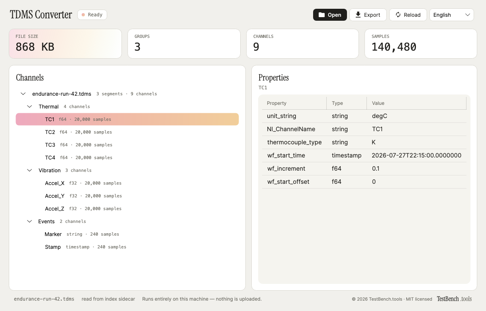

# TDMS Converter

A desktop viewer and CSV converter for TDMS measurement files. Open a `.tdms`, see its
groups, channels and — the part a plain CSV throws away — every property, then export the
channels you actually need.

Part of the [TestBench.tools](https://testbench.tools) suite for T&M, embedded and industrial
automation engineers. Everything runs locally: the app makes no network requests and uploads
nothing.



## What it does

- **Reads the whole TDMS model.** File → group → channel, with arbitrary properties at every
  level. Properties are shown next to the tree and can be carried into the exported CSV.
- **Streams instead of loading.** The file is consumed segment by segment; nothing bigger than
  a chunk is ever held. Files far larger than RAM open and convert.
- **Uses the `.tdms_index` sidecar.** When LabVIEW wrote one, the channel list, the properties
  and the sample counts come from it, so listing a multi-gigabyte measurement costs a few
  hundred kilobytes of reads. Without a sidecar the data file is scanned and its raw sections
  are seeked over rather than read.
- **Survives files that were killed mid-write.** A truncated final segment (the
  `0xFFFFFFFF…` next-segment marker) keeps everything before the incomplete tail and flags the
  file as truncated instead of failing. Half-written values are dropped, never guessed.
- **Handles incremental segments.** Segments that reuse the previous raw index (index header
  `0x00000000`), segments with several chunks and segments with raw data but no metadata at
  all are all read.
- **Derives waveform time axes.** `wf_start_time`, `wf_increment` and `wf_start_offset` produce
  the time column; per-sample times are never stored.
- **Exports CSV**, with or without a leading property header, with a comma, semicolon or tab
  separator, and with progress and cancel.
- **Speaks five languages.** English (default), 한국어, 日本語, Deutsch, 简体中文, switched at
  runtime and remembered across restarts.

## Data types

`i8` `i16` `i32` `i64` `u8` `u16` `u32` `u64` `f32` `f64` `bool` `string` `timestamp`

`i64` and `u64` never round-trip through a `double`, so counters beyond 2^53 keep every digit.
Timestamps are the TDMS pair of `i64` seconds since 1904-01-01 UTC and `u64` fractions of a
second, written as ISO 8601 UTC.

## Not supported

The reader refuses these with a clear message rather than producing numbers that would be
silently wrong:

| Feature | Why it is refused |
|---|---|
| Big-endian segments (`kTocBigEndian`) | Byte order is not swapped; values would be garbage. |
| Interleaved raw data (`kTocInterleavedData`) | The sample layout differs; channels would be mixed. |
| DAQmx raw data (`kTocDAQmxRawData`, raw index `0x69120000` / `0x69130000`) | Requires the DAQmx scaler model to convert counts to engineering units. |
| Multi-dimensional channels (`dimension ≠ 1`) | The model is one array per channel. |
| A channel that changes its data type mid-file | One channel, one type. |
| Object paths deeper than group/channel | TDMS is a three-level model here. |

Export targets are CSV and CSV-with-property-header. The exporters sit behind
`ITdmsExporter`, so HDF5 or Parquet writers can be added without touching the reader.

## Install

Download the release for your platform and run it — there is no installer and no runtime to
set up. The app is self-contained.

To build it yourself you need the [.NET 8 SDK](https://dotnet.microsoft.com/download).

## Build

```sh
dotnet build TestBenchTdmsConverter.sln -c Release
dotnet test TestBenchTdmsConverter.sln
dotnet run --project src/Tdms.App
```

Publishing a single self-contained executable:

```sh
dotnet publish src/Tdms.App -c Release -r win-x64 \
  -p:PublishSingleFile=true -p:SelfContained=true
```

Replace `win-x64` with `osx-arm64`, `osx-x64` or `linux-x64` as needed.

## Layout

| Project | What it holds |
|---|---|
| `src/Tdms.Core` | The parser, the model and the exporters. Pure .NET, no UI dependency. |
| `src/Tdms.App` | The Avalonia UI. |
| `tests/Tdms.Core.Tests` | A spec-conformant TDMS **writer** plus round-trip, streaming, truncation, sidecar and CSV tests. |
| `tests/Tdms.App.Tests` | Headless UI tests and the reproducible README screenshot. |

The tests write TDMS files whose every byte is known, read them back with the production
parser and compare the tree, every property and every sample. The same file fed in 1-byte,
3-byte, 13-byte and 4096-byte chunks must produce byte-identical results.

## Using the library

```csharp
using Tdms.Core;
using Tdms.Core.Export;

// Tree, properties and sample counts — no samples decoded.
var document = TdmsFileReader.ReadMetadata("run42.tdms");
foreach (var channel in document.Channels)
{
    Console.WriteLine($"{channel.Path}  {channel.DataType}  {channel.SampleCount}");
}

// Convert two channels, streaming, with the properties kept as comment lines.
using var output = File.Create("run42.csv");
TdmsExporters.CsvWithProperties.Export(
    new TdmsExportRequest
    {
        SourcePath = "run42.tdms",
        ChannelPaths = [TdmsPath.ForChannel("Thermal", "TC1"), TdmsPath.ForChannel("Thermal", "TC2")],
        Metadata = document,
    },
    output);
```

© 2026 TestBench.tools · MIT licensed — free and open source.
